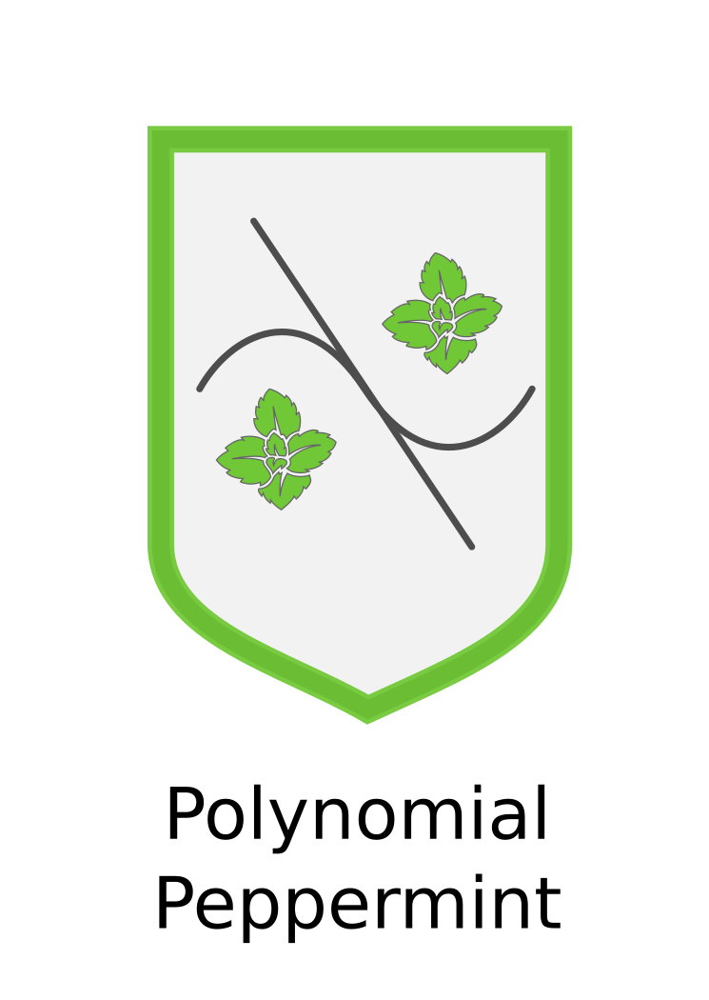

### Successfully completed SPICED Education's Data Science program.

Topics covered within the bootcamp:

#### Data Analysis in Python
- Numpy, Pandas, Pandas ,Data Wrangling, Regular Expressions, Pamdas Time Series, Debugging

#### Classification model / algorithm
- Logistic Regression, Evaluating classifiers, Cross-validation, Feature Engineering, Random Forests / Tree-Based Models, Hyperparameter optimization / Kaggle Submission

#### Regression model / algorithm
- Gradient descent, Linear Regression,Regularization

#### Text Classification
- Regular Expressions, Bag of Words, Bayesian methods, Spacy, BeautifulSoup, Scrapy

#### Recommenders
- Retrospective /  Unsupervised Learning, SQL Queries I, Matrix Factorization,Collaborative Filtering, NMF

#### Software engineering
- Automated testing, Cookiecutter, Travis CI, Pylint / PEP8, git GitHub

#### Deep Learning Pt. 1
- Keras (+ virtual environments), Sklearn mnist challenge, Regularizing ANNs / Training Strategies,
PCA, Artificial Neural Networks (ANNs): Intro, Keras II / ANN hyperparameters

#### Deep Learning Pt. 2
- Backpropagation I, Convolutional Neural Networks, Transfer Learning, Support Vector Machines, Classes, Backpropagation II, Neural Style Transfer, ResNet50, YOLO

#### Online Dashboards
- AWS, Deploying, Data Modeling / Docker, Metabase on AWS, Flask, MONGO-DB

#### Social networks Sentiment Analysis
- NoSQL/ MongoDB, Word Embeddings, Recurrent Neural Networks, Elasticearch, Web form to Database, Sentiment Analysis

#### Advanced Tools
- Reinforcement Learning, TensorFlow. MapReduce, Spark, Adversarial Networks

You will find examples of Jupyter notebooks within the notebooks folder.
